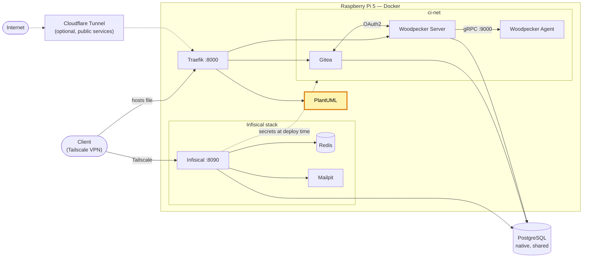

# PlantUML Server — diagrammes auto-hébergés (homelab)

[English version](README.md)

[](https://github.com/Alithiel31/plantuml-traefik/actions/workflows/lint-markdown.yml) [](LICENSE)   [](https://plantuml.com/)

Serveur [PlantUML](https://plantuml.com/) auto-hébergé, utilisé pour générer des diagrammes UML à partir de texte (architecture, séquence, etc.).

## Vue d'ensemble

Conçu pour un homelab Docker avec [Traefik](https://github.com/Alithiel31/traefik-homelab) en reverse proxy. Service strictement interne, jamais exposé publiquement — pas de route publique, pas de port publié sur l'hôte.

## Architecture du homelab

Place de ce projet dans le homelab (en surbrillance) :



## Choix de conception

- Service sans état et sans secret : tout ce qui varie vit dans `.env`, ce qui rend le dépôt réutilisable tel quel.
- Aucun port publié : le seul accès passe par Traefik, sur le réseau privé.
- Tag d'image, réseau Traefik, entrypoint et nom d'hôte sont des paramètres, donc compatible avec n'importe quelle installation Traefik.

## Prérequis

- Docker + Docker Compose
- Un réseau Docker externe correspondant à `TRAEFIK_NETWORK`
- Une instance Traefik déjà en place, écoutant sur l'entrypoint défini par `TRAEFIK_ENTRYPOINT`, avec le provider Docker activé (labels)

## Installation

```bash
cp .env.example .env
# éditer .env selon son environnement
docker compose up -d
```

## Réseau

Le conteneur ne publie aucun port. Il rejoint un réseau Docker externe déjà créé par l'instance Traefik du serveur, et est routé via un nom d'hôte interne défini dans `.env` (variable `PLANTUML_HOST`).

Ce nom d'hôte n'existe que sur le réseau local : il doit être ajouté manuellement dans le fichier `hosts` de chaque machine cliente, pointant vers l'adresse du serveur, par exemple :

```text
<adresse-du-serveur>  <valeur-de-PLANTUML_HOST>
```

(Windows : `C:\Windows\System32\drivers\etc\hosts`, en admin ; Linux/macOS : `/etc/hosts`)

Accès ensuite via `http://<valeur-de-PLANTUML_HOST>:<port-entrypoint-traefik>` (`8000` avec la configuration par défaut de [traefik-homelab](https://github.com/Alithiel31/traefik-homelab)), uniquement joignable depuis le réseau privé du serveur (VPN/tailnet).

## Configuration

Pas de secret à gérer (le service n'en a pas besoin). Les valeurs variables sont externalisées dans `.env` :

| Variable | Défaut | Description |
|---|---|---|
| `PLANTUML_IMAGE_TAG` | `jetty` | Tag de l'image Docker Hub `plantuml/plantuml-server` |
| `TRAEFIK_NETWORK` | `traefik-net` | Réseau Docker externe créé par Traefik |
| `TRAEFIK_ENTRYPOINT` | `web` | Entrypoint Traefik utilisé pour le routage interne |
| `PLANTUML_HOST` | `plantuml.internal` | Nom d'hôte interne, résolu uniquement via le fichier `hosts` |
| `PLANTUML_INTERNAL_PORT` | `8080` | Port Jetty dans le conteneur (ne pas changer sauf changement d'image) |

`.env` est ignoré par git (`.gitignore`) — partir de `.env.example` et l'adapter à son propre environnement (nom de réseau Traefik, nom d'hôte interne, etc.).

## Utilisation

- Éditeur web : `http://<valeur-de-PLANTUML_HOST>:<port>/`
- Rendu depuis un client ou un plugin d'éditeur : le pointer vers `http://<valeur-de-PLANTUML_HOST>:<port>` (endpoints `/png/`, `/svg/`, `/txt/` suivis du diagramme encodé).

## Procédures courantes

- **Mise à jour** : `docker compose pull && docker compose up -d`. `PLANTUML_IMAGE_TAG=jetty` est un tag mouvant ; épingler une version exacte dans `.env` pour des déploiements reproductibles.
- **Logs** : `docker logs -f plantuml`

## Sécurité

Ce dépôt est public : aucun secret, aucune information d'infrastructure réelle (nom de serveur, adresse IP, domaine) n'y figure. Toutes les valeurs concrètes vivent uniquement dans le `.env` local, non versionné.

## Projets liés

| Dépôt | Rôle |
| --- | --- |
| [traefik-homelab](https://github.com/Alithiel31/traefik-homelab) | Reverse proxy sur lequel ce service se branche |
| [woodpecker-ci-homelab](https://github.com/Alithiel31/woodpecker-ci-homelab) | Gitea + Woodpecker CI |
| [infisical-homelab](https://github.com/Alithiel31/infisical-homelab) | Gestionnaire de secrets |

## Licence

[MIT](LICENSE)
