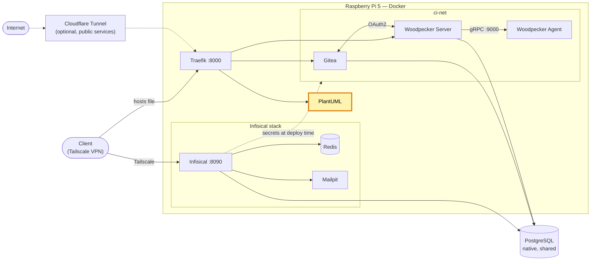

# PlantUML Server — self-hosted diagrams (homelab)

[Version française](README.fr.md)

[](https://github.com/Alithiel31/plantuml-traefik/actions/workflows/lint-markdown.yml) [](LICENSE)   [](https://plantuml.com/)

Self-hosted [PlantUML](https://plantuml.com/) server, used to generate UML diagrams from text (architecture, sequence, etc.).

## Overview

Designed for a Docker homelab with [Traefik](https://github.com/Alithiel31/traefik-homelab) as reverse proxy. Strictly internal service, never exposed publicly — no public route, no port published on the host.

## Homelab architecture

Where this project sits in the homelab (highlighted):



## Design choices

- Stateless service with no secrets: everything variable lives in `.env`, which makes the repository reusable as-is.
- No published port: the only way in is through Traefik, over the private network.
- Image tag, Traefik network, entrypoint and hostname are all parameters, so it fits any Traefik setup.

## Prerequisites

- Docker + Docker Compose
- An external Docker network matching `TRAEFIK_NETWORK`
- A running Traefik instance, listening on the entrypoint defined by `TRAEFIK_ENTRYPOINT`, with the Docker provider enabled (labels)

## Installation

```bash
cp .env.example .env
# edit .env for your own environment
docker compose up -d
```

## Networking

The container doesn't publish any port. It joins an external Docker network already created by the server's Traefik instance, and is routed via an internal hostname defined in `.env` (`PLANTUML_HOST`).

This hostname only exists on the local network: it must be added manually to the `hosts` file of every client machine, pointing to the server's address, e.g.:

```text
<server-address>  <PLANTUML_HOST-value>
```

(Windows: `C:\Windows\System32\drivers\etc\hosts`, run as admin; Linux/macOS: `/etc/hosts`)

Then reachable at `http://<PLANTUML_HOST-value>:<traefik-entrypoint-port>` (`8000` with the default [traefik-homelab](https://github.com/Alithiel31/traefik-homelab) setup), only from the server's private network (VPN/tailnet).

## Configuration

No secrets to manage (the service doesn't need any). Variable values are externalized in `.env`:

| Variable | Default | Description |
|---|---|---|
| `PLANTUML_IMAGE_TAG` | `jetty` | Tag of the Docker Hub image `plantuml/plantuml-server` |
| `TRAEFIK_NETWORK` | `traefik-net` | External Docker network created by Traefik |
| `TRAEFIK_ENTRYPOINT` | `web` | Traefik entrypoint used for internal routing |
| `PLANTUML_HOST` | `plantuml.internal` | Internal hostname, resolved only through the `hosts` file |
| `PLANTUML_INTERNAL_PORT` | `8080` | Jetty port inside the container (don't change unless the image changes) |

`.env` is git-ignored (`.gitignore`) — start from `.env.example` and adapt it to your own environment (Traefik network name, internal hostname, etc.).

## Usage

- Web editor: `http://<PLANTUML_HOST-value>:<port>/`
- Render from a client or an editor plugin by pointing it at `http://<PLANTUML_HOST-value>:<port>` (endpoints `/png/`, `/svg/`, `/txt/` followed by the encoded diagram).

## Common operations

- **Update**: `docker compose pull && docker compose up -d`. `PLANTUML_IMAGE_TAG=jetty` is a moving tag; pin an exact version in `.env` for reproducible deployments.
- **Logs**: `docker logs -f plantuml`

## Security

This repository is public: it contains no secrets and no real infrastructure information (server name, IP address, domain). All actual values live only in the local `.env` file, which is not version-controlled.

## Related projects

| Repository | Role |
| --- | --- |
| [traefik-homelab](https://github.com/Alithiel31/traefik-homelab) | Reverse proxy this service plugs into |
| [woodpecker-ci-homelab](https://github.com/Alithiel31/woodpecker-ci-homelab) | Gitea + Woodpecker CI |
| [infisical-homelab](https://github.com/Alithiel31/infisical-homelab) | Secrets manager |

## License

[MIT](LICENSE)
